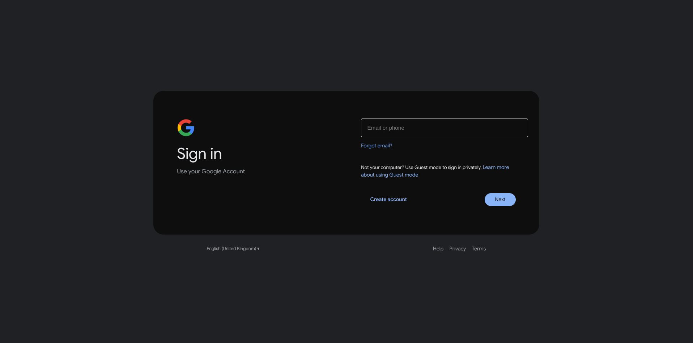
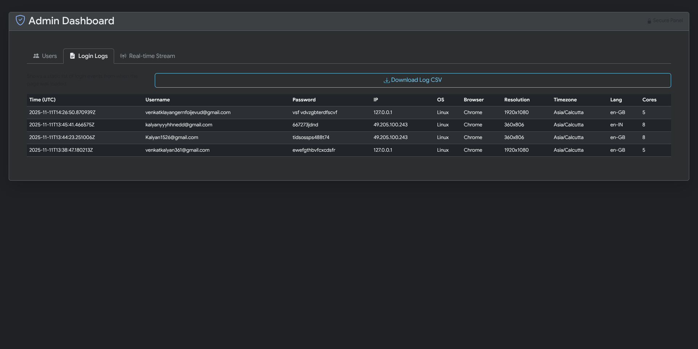
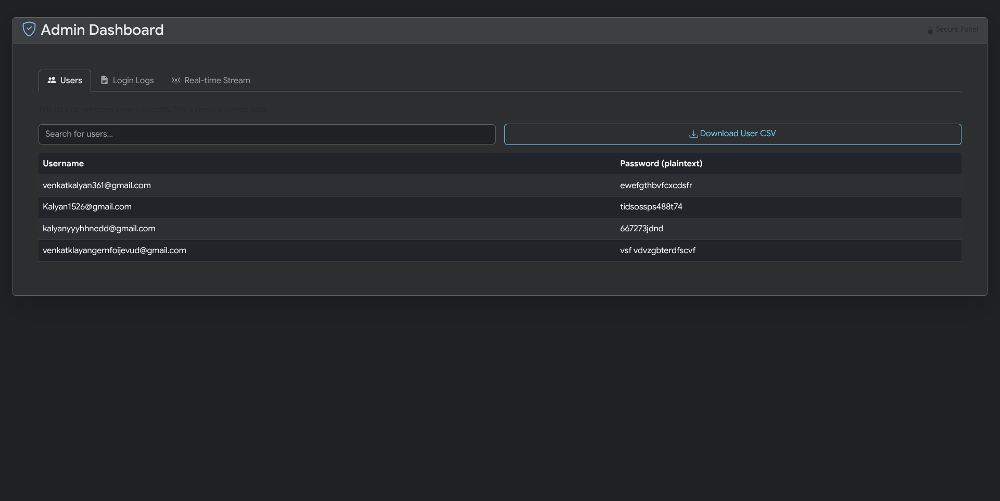
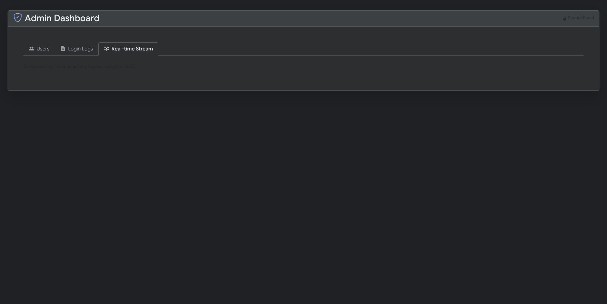

# 🧠 Social Engineering Project


> ⚠️ **Note:** This project is for educational and demonstration purposes only. It is not intended for production use.

---

## 🎯 About the Project

This is a comprehensive web application, built with FastAPI and Socket.IO, that provides a complete user authentication system and a powerful, real-time admin dashboard for monitoring.

The project is split into two main parts:
1.  **A User-Facing Portal:** A modern, responsive, Google-style interface for users to sign up and log in.
2.  **An Admin Dashboard:** A secure, single-page application for an administrator to monitor all user activity in real-time, view historical logs, and manage user data.

## ✨ Key Features

### 🔐 User-Facing Features

* **Modern, Responsive UI:** The entire user-facing site (`login.html`, `signup.html`) is styled to look and feel like the modern Google sign-in flow. It features a dark-mode "box" container on desktop that collapses to a clean, single-column layout on mobile devices.
* **Multi-Step Sign-up:** The `signup.html` page provides a 4-step user registration flow (Name, Basic Info, Username, Password) guided by JavaScript, matching the experience of a professional web service.
* **Detailed Client-Side Logging:** This is a core feature. When a user logs in, the `login.html` page uses JavaScript to discreetly collect a comprehensive snapshot of their device, including:
    * Operating System (e.g., Windows, MacOS, Linux)
    * Browser (e.g., Chrome, Firefox, Safari)
    * Screen Resolution
    * Timezone
    * Language
    * Number of CPU Cores
    * Full User-Agent string

### 🧑‍💼 Admin-Facing Features

The `admin_dashboard.html` is a "single-pane-of-glass" for all monitoring, protected by a separate admin login (`admin_login.html`). It includes:

* **Three-Tab Interface:** All information is organized into three main sections:
    1.  **Users Tab:** Displays a list of all registered users. This list automatically refreshes every 5 seconds by polling the `/api/get_users` endpoint. It also includes a live search bar and a "Download CSV" button to export the user list.
    2.  **Login Logs Tab:** Shows a detailed, historical table of every login event (both successful and failed) since the server started. This table includes all the rich device information (OS, browser, IP, etc.) collected from the login page. This entire log can be downloaded as a CSV.
    3.  **Real-time Stream Tab:** This is the primary monitoring feature. It connects to the FastAPI backend via Socket.IO. When any user attempts to log in, their complete login event (including all device info) is instantly broadcast and appears at the top of this feed with an animation, allowing for live tracking of all user activity.

## 💻 Technology Stack

| Layer | Technology | Description |
|---|---|---|
| **Backend** | FastAPI | A modern, high-performance Python web framework for building APIs. |
| **Real-time** | Python-SocketIO | Enables real-time, bidirectional communication for the admin dashboard. |
| **Server** | Uvicorn | An ASGI server, required to run the FastAPI application. |
| **Frontend** | Jinja2 Templates | Used to serve the HTML pages from the FastAPI backend. |
| **Styling** | Bootstrap 5 | For the modern, responsive layout of all pages. |

## 📸 Screenshots

<table>
  <tr>
    <td align="center"><b>Login (Desktop)</b></td>
    <td align="center"><b>Login (Mobile / Logs)</b></td>
  </tr>
  <tr>
    <td></td>
    <td></td>
  </tr>
  <tr>
    <td align="center"><b>Admin - Users Tab</b></td>
    <td align="center"><b>Admin - Logs Tab</b></td>
  </tr>
  <tr>
    <td></td>
    <td></td>
  </tr>
  <tr>
    <td align="center" colspan="2"><b>Admin - Real-Time Stream</b></td>
  </tr>
  <tr>
    <td align="center" colspan="2"></td>
  </tr>
</table>

## ⚙️ Getting Started

To get a local copy up and running, follow these simple steps.

### 1️⃣ Prerequisites

* Python 3.8+
* pip (Python package installer)

### 2️⃣ Installation

1.  **Clone the repository:**
    ```sh
    git clone [https://github.com/your-username/your-project-name.git](https://github.com/your-username/your-project-name.git)
    cd your-project-name
    ```

2.  **Install dependencies:**
    ```bash
    pip install "fastapi[all]" uvicorn python-socketio
    ```

### 3️⃣ Configuration
This project likely requires an admin secret to protect the dashboard. Set this as an environment variable:

**On Linux/macOS:**
```bash
export ADMIN_SECRET="your_super_secret_password"
```
### On Windows (CMD):
- cmdset ADMIN_SECRET="your_super_secret_password"
- If no variable is set, the app defaults to the insecure password adminpass.
## ▶️ Running the Application
- Start the development server using Uvicorn:
```uvicorn main:sio_app --reload --port 8000```
## Access the app in your browser:
- 👉 http://127.0.0.1:8000
- 🌐 How to Use
- 🧑 User Pages

Sign Up: ```http://127.0.0.1:8000/signup ```
Login:```http://127.0.0.1:8000/login```

## 🧠 Admin Pages

### Visit
```http://127.0.0.1:8000/admin/login ```
Enter your ADMIN_SECRET password.
- Access the dashboard at ```http://127.0.0.1:8000/admin/dashboard```

### Testing Real-Time Features
- Open the admin dashboard in one browser tab.
- Log in as a user from another tab.
- Watch new login events appear instantly on the “Real-Time Stream” tab.

## ⚠️ Security Warning
This is a prototype/demo — not for production use.

- ❌ Insecure storage: All users and logs are stored in memory only.
- ❌ Plaintext passwords: For demonstration purposes only.
- ❌ No CSRF protection: Forms are not secured against CSRF attacks.

Use this project only for learning, prototyping, or academic purposes.
## 💡 Future Enhancements (Ideas)

- ✅ Replace in-memory storage with SQLite or PostgreSQL.
- ✅ Hash passwords securely (e.g., bcrypt or passlib).
- ✅ Add JWT-based authentication.
- ✅ Integrate a proper frontend build (React or Vue).
- ✅ Add WebSocket authentication & user sessions.

## 🧑‍💻 Author
Kalyan
GitHub: @K4LYAN
🪪 License
#### **This project is released under the MIT License.**
#### **Feel free to fork, modify, and experiment responsibly.**
